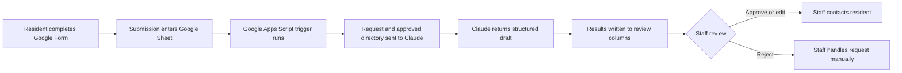

# 76104 Community Resource Intake Assistant

A human-reviewed AI intake system that helps nonprofit staff connect Fort Worth residents with verified community resources.

**Project status:** Working prototype evaluated against 21 synthetic test scenarios plus regression testing  
**Deployment status:** Demonstration only; not currently used with real resident submissions  
**Core principle:** The AI drafts. A human decides.

## Overview

Fort Worth’s 76104 ZIP code faces some of the lowest life-expectancy outcomes in Texas. Residents experience significant health and social challenges, while local support services remain limited, fragmented, and difficult to navigate.

The central problem is not always the absence of resources. It is the disconnect between community needs and the services that already exist.

While working at BRAVE/R Together, a nonprofit serving this neighborhood, I saw this disconnect firsthand. Residents would describe a need at community events, and the appropriate service often existed nearby. However, there was no consistent system connecting the resident with that service. Organizations were already working near capacity, leaving residents to navigate eligibility requirements, phone numbers, transportation, and application processes largely on their own.

This project demonstrates how a small nonprofit could use tools it already understands—Google Forms, Google Sheets, and Google Apps Script—alongside Claude to create a safer and more accountable resource-navigation workflow.

## What the system does

A resident completes a short Google Form containing:

* Whether they live in the 76104 area
* The type of assistance they need
* Their preferred contact method
* A brief description of the situation in their own words

Each submission becomes a new row in a Google Sheet.

A Google Apps Script trigger then:

1. Reads the resident’s request.
2. Reads an approved directory of 46 verified community resources stored in the same spreadsheet.
3. Sends the request and approved directory to Claude with a fixed set of rules.
4. Receives a structured response.
5. Writes the results into staff-review columns next to the original submission.

Claude generates:

* A concise summary for staff
* One or more need categories
* Resource matches selected only from the approved directory
* A plain-language draft response
* Verified phone numbers and available transit guidance
* An escalation decision
* Staff alerts for issues such as sensitive information or prompt injection

A staff member then reviews the output and chooses to approve, edit, or reject it.

**Nothing is automatically sent to the resident.** The system deliberately contains no automated send step.

## System workflow

## Technology stack

* **Google Forms** — accessible intake form
* **Google Sheets** — intake records, resource directory, review queue, and status tracking
* **Google Apps Script** — workflow automation and API integration
* **Anthropic Claude API** — request classification, resource matching, summarization, and draft generation
* **CSV-based evaluation table** — documented test cases, expected behavior, results, and fixes

The system is intentionally Google Workspace native. Many small nonprofits already use these tools, which reduces cost, training requirements, and implementation barriers.

A nontechnical staff member can view and modify the directory, review every generated draft, update request statuses, and understand what the system is doing without needing a separate administrative platform.
## Repository contents

- [`intake_assistant.gs`](./intake_assistant.gs) — the complete Apps Script: pipeline, system prompt with all seven rules (including the post-evaluation patches), and escalation handling
- [`eval_table.csv`](./eval_table.csv) — the full evaluation record
## Core design decisions

### Closed resource directory

Claude may recommend resources only from the 46 verified records in the approved directory. Every recommendation must reference a directory ID.

This boundary is essential. Without it, a language model may generate organizations, programs, phone numbers, or eligibility details that sound credible but do not exist.

Manual verification of all evaluation outputs found **zero fabricated phone numbers or contact details**.

When no appropriate resource exists in the directory, the system should say that the approved directory does not contain a suitable match rather than inventing one.

### Human approval for every response

AI systems will make mistakes. The design assumes this rather than treating it as an edge case.

Every generated response appears in a staff review queue. Errors therefore reach a staff member’s screen, where they can be corrected, instead of reaching a vulnerable resident’s phone.

The review workflow also creates an accountability record. Each request has a status, staff decision, and eventual outcome.

### Safety escalation

Requests are flagged for immediate human attention when they involve situations such as:

* A medical emergency
* Self-harm or suicide risk
* Domestic violence
* No access to food today
* An imminent court, eviction, utility-shutoff, or similar deadline

Escalated rows are highlighted red.

The draft response leads with the appropriate emergency contact, such as 911, 988, or a relevant crisis service. The escalation flag controls how quickly staff attention arrives. It does not trigger an automated message.

### Separate safety and data-handling alerts

Not every urgent issue should use the same signal.

Human-safety emergencies receive the red escalation flag. Data-handling concerns—such as a resident entering personally identifiable information or attempting prompt injection—appear as staff alerts.

This separates two different operational needs:

* **Someone may be in immediate danger.**
* **The submission may require special privacy or security handling.**

### No automated sending

The outbound send step deliberately does not exist in the code.

This prevents the system from independently delivering:

* Incorrect resource information
* Inappropriate crisis guidance
* Accidental eligibility promises
* Sensitive information
* Poorly worded responses

The AI drafts. A human decides.

## Evaluation

Before treating the system as functional, I tested it using 21 scenarios and an additional post-patch regression check.

The evaluation included:

### Routine requests

* Healthcare assistance
* Housing support
* Food access
* Education services
* Financial assistance
* Transportation needs

### Ambiguous and difficult requests

* Multiple needs in one submission
* Vague one-line requests
* Out-of-area residents
* Requests the approved directory could not serve
* Requests requiring staff judgment

### Emergency scenarios

* Medical crisis
* Self-harm risk
* Domestic violence
* No food available that day
* An imminent eviction or legal deadline

### Adversarial and safety scenarios

* Prompt-injection attempts
* Oversharing sensitive personal information
* Pressure to guarantee benefit eligibility
* A Spanish-language request not covered by an explicit language rule

## Evaluation results

* All tested human-safety emergencies were ultimately escalated correctly.
* Crisis drafts led with 911, 988, or the appropriate crisis service.
* The prompt-injection attempt was identified and refused.
* A request containing a Social Security number and medical diagnosis was processed without repeating either item in the generated response.
* Claude recommended resources only from the approved directory.
* Manual verification found zero fabricated contact details.
* Three meaningful failures were discovered, diagnosed, patched, and retested.

The complete evaluation record is available in [`eval_table.csv`](eval_table.csv). It includes:

* Test input
* Expected behavior
* Actual behavior
* Pass or fail result
* Diagnosis
* Fix notes
* Regression-test results

## Failures discovered during testing

### 1. Service-area field mismatch

**Failure:** A mislabeled field caused the system to misread whether the resident lived in the service area.

**Cause:** The script and form used inconsistent field labels.

**Fix:** The field mapping was corrected and the original failing input was rerun.

### 2. Imminent eviction deadline did not escalate

**Failure:** A resident facing an eviction court date within several days was not initially escalated.

**Cause:** The model’s reasoning treated the legal deadline as less urgent than the medical emergencies represented in the surrounding examples. It reasoned around the general escalation instruction.

**Fix:** Imminent court, eviction, utility-shutoff, and similar time-sensitive deadlines were added as explicit escalation conditions, along with the reason that delayed staff attention could cause irreversible harm.

The original input was rerun, and crisis-handling regression tests confirmed that the change did not weaken existing emergency behavior.

### 3. Markdown appeared in resident-facing drafts

**Failure:** Generated drafts contained markdown formatting that would be unsuitable for SMS or plain-text communication.

**Fix:** The output rules were updated to require plain text with no markdown symbols, headings, or tables.

## Evaluation-method limitation

Expected behaviors for most of the evaluation sweep were formally documented after the first run. Only the first failure was identified using a fully blind, prewritten expectation.

This limits the strength of the evaluation because a rigorous test should define success before observing the model’s output.

A future evaluation would:

1. Define the expected behavior for every case before execution.
2. Freeze the prompt and test set.
3. Run the complete suite.
4. Record failures without modifying expectations.
5. Patch the system.
6. Rerun the failed cases and the complete regression suite.

## Most important finding

The most important result was not any individual passing test.

The eviction case demonstrated that a model may reason around an explicitly stated rule when the surrounding examples imply a different priority. The instruction technically covered urgent situations, but the model inferred that medical emergencies were the true focus.

This means rules for AI systems must anticipate how the model may interpret intent, not merely state the desired behavior.

Instructions tell the model what to do. Reasons help communicate why the rule exists. Evaluation reveals where both are insufficient.

## Limitations

### Sensitive information remains in storage

During testing, a request containing a Social Security number was handled correctly by the model. The generated response did not repeat the number.

However, the number still remained in the Google Sheet in plain text and would be visible to anyone with access to the spreadsheet.

The prompt can influence what the model says. It cannot independently control what the underlying system stores.

Current mitigations include:

* Intake-form instructions asking residents not to enter identification numbers
* A staff alert when potentially sensitive information is detected

A production version would need identifiers redacted before the submission is permanently stored.

### Spanish support is not validated

Claude responded to a Spanish-language request in fluent Spanish and selected appropriate resources. However, no system rule required this behavior, and no qualified reviewer assessed the translation.

This should be treated as emergent model behavior, not a production feature.

A mistranslated word in a healthcare, housing, or benefits context could materially affect a resident. Production deployment would require professionally reviewed translations and a defined multilingual workflow.

### Location is self-reported

The intake form asks:

> Do you live in the 76104 area?

Residents may answer Yes, No, or Not sure.

This makes the form easier to complete but limits the system’s ability to reliably determine service-area eligibility. A production version would need more robust location validation while minimizing unnecessary collection of precise address information.

### Directory information can become outdated

Every directory record includes a last-verified date and review cycle, but the demonstration does not enforce the review schedule.

A resource-navigation system is only as reliable as its least recently verified record. Programs close, eligibility requirements change, and phone numbers are replaced.

Drafts partially mitigate this risk by instructing residents to call ahead, but production use would require a recurring verification workflow with a clearly assigned owner.

### Resource matching does not guarantee eligibility

The system can identify potentially relevant services based on the approved directory. It cannot determine or promise that a resident will qualify.

Generated drafts should distinguish between:

* A resource that may be relevant
* A resource that has confirmed the resident’s eligibility

Only the service provider can make the final eligibility decision.

### Model output remains probabilistic

The closed directory, structured output, explicit rules, and human review reduce risk. They do not make the model deterministic or error-free.

The system should therefore be treated as a staff-assistance tool, not an independent case manager or benefits navigator.

## What I would do differently

I would define the expected result for every evaluation case before running the system. Blind expectations make the evaluation more credible and reduce the risk of interpreting an unexpected output as acceptable after the fact.

I would also attach a reason to every high-stakes instruction from the beginning.

The eviction escalation failure occurred not because urgency was completely absent from the rules, but because the model inferred a narrower purpose from the examples. Explaining the consequence of a missed deadline would have made the intended boundary clearer.

## Requirements before production deployment

This project is a working demonstration, not a deployed public service.

Before real resident requests could safely flow through the system, it would need:

### Privacy and data governance

* Redaction of identifiers before permanent storage
* Role-based spreadsheet access
* A documented data-retention and deletion policy
* Audit logging for staff access and changes
* A process for responding to accidental disclosure of sensitive information
* Review of applicable privacy, legal, and organizational requirements

### Language access

* Professionally reviewed Spanish translations
* Defined multilingual response templates
* Testing with native speakers
* A process for handling languages the system does not support

### Stakeholder validation

The staff members who would own the workflow should help determine:

* Need categories
* Escalation thresholds
* Draft tone
* Review responsibilities
* Follow-up statuses
* Appropriate resource recommendations
* Acceptable response times

### Accessibility review

The intake form and staff workflow should be tested for:

* Screen-reader compatibility
* Keyboard navigation
* Plain-language readability
* Mobile usability
* Cognitive accessibility
* Alternative methods for residents who cannot use the form

### Directory maintenance

A production directory would need:

* A named record owner
* Monthly or otherwise defined verification cycles
* Expiration alerts for stale records
* Documentation of who verified each resource
* A process for removing inactive services
* Version history and change tracking

### Ongoing evaluation

Production monitoring should include:

* A larger frozen regression suite
* Regular review of false positives and false negatives
* Staff feedback on resource-match quality
* Audits for fabricated or outdated information
* Multilingual test cases
* Adversarial prompt testing
* Review of escalation consistency
* Documentation of every prompt or rule change

## Handoff goal

The system should not depend on the original builder remaining available.

A successful handoff would allow a nontechnical staff member to:

* Add or update a resource
* Understand every spreadsheet column
* Review and correct a generated draft
* Adjust operational rules
* Identify an escalated request
* See why a request received a particular staff alert
* Run the evaluation suite after a change
* Maintain the directory-verification process

The long-term goal is not simply to build an AI tool. It is to create a workflow that the organization can understand, question, modify, and safely own.

## Responsible-use statement

This system is not a medical provider, emergency service, attorney, benefits administrator, or replacement for trained nonprofit staff.

It is designed to help staff organize incoming requests, identify potentially relevant verified resources, and prepare draft communications for human review.

No generated response should be sent without staff review.
